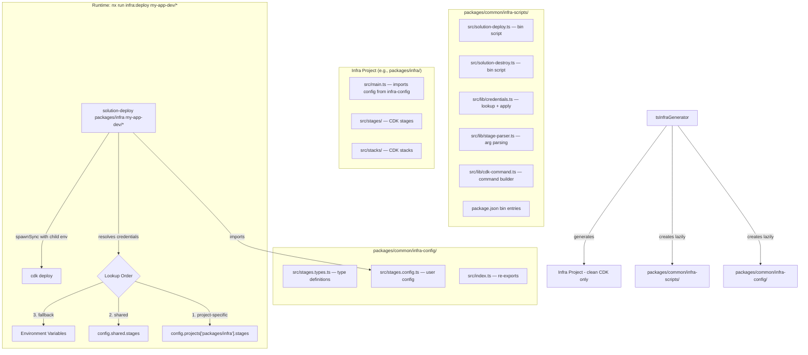

# Design Document: Stage Credential Mapping (Redesign)

## Overview

This redesign replaces the previous per-project `deploy-stage.ts` approach with two shared Nx library packages under `packages/common/`:

1. **`packages/common/infra-config/`** — Types and user-editable stage configuration. Importable from any package via scope alias.
2. **`packages/common/infra-scripts/`** — Centralized `solution-deploy` and `solution-destroy` bin scripts. Registered in `package.json` `bin` so they appear in `node_modules/.bin/`.

This solves the key issues from the previous implementation:
- **PATH resolution**: bin scripts in `node_modules/.bin/` work like `cdk` itself — no `tsx` on PATH needed
- **No per-project boilerplate**: infra projects contain only clean CDK code
- **Proper cross-package imports**: `infra-config` is a real Nx library with tsconfig, so any package can import it
- **Environment isolation**: credentials are passed via `spawnSync` `env` option, never polluting the parent process
- **Account/region in config**: `StageConfig` includes `region` (required) and `account` (optional, inferred from profile via STS if omitted)

The previous implementation's files (`deploy-stage.ts.template`, `config/stages.config.ts.template`, `config/stages.types.ts.template`, `deploy-stage.spec.ts`) are removed as part of this work.

## Architecture



### How It Works (End-to-End)

1. **Generation time**: `npx nx generate @aws/nx-plugin:ts#infra --name=infra` creates the CDK project. The generator lazily creates `infra-config` and `infra-scripts` packages if they don't exist (same pattern as `sharedConstructsGenerator`).

2. **Configuration**: Edit `packages/common/infra-config/src/stages.config.ts`:
   ```typescript
   import type { StagesConfig } from './stages.types.js';
   export default {
     projects: {
       'packages/infra': {
         stages: {
           'my-app-dev': {
             credentials: { type: 'profile', profile: 'dev-account' },
             region: 'us-east-1',
           },
           'my-app-prod': {
             credentials: { type: 'assumeRole', assumeRole: 'arn:aws:iam::123456789012:role/DeployRole' },
             account: '123456789012',
             region: 'us-west-2',
           },
         },
       },
     },
     shared: {
       stages: {
         'sandbox': {
           credentials: { type: 'profile', profile: 'personal-sandbox' },
           region: 'us-east-1',
         },
       },
     },
   } satisfies StagesConfig;
   ```

3. **Deploy time**: `pnpm nx run infra:deploy my-app-dev/*` → Nx runs `solution-deploy packages/infra my-app-dev/*`:
   - Imports config from `@my-scope/common-infra-config`
   - Looks up `config.projects['packages/infra'].stages['my-app-dev']`
   - Builds child env with `AWS_PROFILE=dev-account`
   - Spawns `cdk deploy --require-approval=never my-app-dev/*` with the child env

4. **main.ts at generation time**: Imports stage config to set `env` on CDK stages:
   ```typescript
   import stagesConfig from ':my-scope/common-infra-config';
   const stageConfig = stagesConfig.projects?.['packages/infra']?.stages?.['my-app-sandbox'];
   new ApplicationStage(app, 'my-app-sandbox', {
     env: {
       account: stageConfig?.account ?? process.env.CDK_DEFAULT_ACCOUNT,
       region: stageConfig?.region ?? process.env.CDK_DEFAULT_REGION,
     },
   });
   ```

## Components and Interfaces

### 1. Shared Infra Config Generator (`sharedInfraConfigGenerator`)

A new utility function following the `sharedConstructsGenerator` pattern. Called lazily by `tsInfraGenerator`.

```typescript
// packages/nx-plugin/src/utils/shared-infra-config.ts
export async function sharedInfraConfigGenerator(tree: Tree): Promise<void> {
  const configDir = joinPathFragments(PACKAGES_DIR, SHARED_INFRA_CONFIG_DIR);
  if (tree.exists(joinPathFragments(configDir, 'project.json'))) {
    return; // Already exists, don't touch it
  }

  // Create as a proper Nx TS library (same as sharedConstructsGenerator)
  await tsProjectGenerator(tree, {
    name: SHARED_INFRA_CONFIG_NAME,
    directory: PACKAGES_DIR,
    subDirectory: SHARED_INFRA_CONFIG_DIR,
  });

  // Delete default src/ and replace with our templates
  tree.delete(joinPathFragments(configDir, 'src'));
  generateFiles(
    tree,
    joinPathFragments(__dirname, 'files', SHARED_INFRA_CONFIG_DIR, 'src'),
    joinPathFragments(configDir, 'src'),
    { /* template vars */ },
    { overwriteStrategy: OverwriteStrategy.KeepExisting },
  );

  await formatFilesInSubtree(tree);
}
```

Constants:
```typescript
// In shared-constructs-constants.ts (or a new shared-infra-constants.ts)
export const SHARED_INFRA_CONFIG_NAME = 'common-infra-config';
export const SHARED_INFRA_CONFIG_DIR = 'common/infra-config';
export const SHARED_INFRA_SCRIPTS_NAME = 'common-infra-scripts';
export const SHARED_INFRA_SCRIPTS_DIR = 'common/infra-scripts';
```

### 2. Shared Infra Scripts Generator (`sharedInfraScriptsGenerator`)

Similar pattern, but also sets up `package.json` bin entries and adds `@aws-sdk/client-sts` as a dependency.

```typescript
// packages/nx-plugin/src/utils/shared-infra-scripts.ts
export async function sharedInfraScriptsGenerator(tree: Tree): Promise<void> {
  const scriptsDir = joinPathFragments(PACKAGES_DIR, SHARED_INFRA_SCRIPTS_DIR);
  if (tree.exists(joinPathFragments(scriptsDir, 'project.json'))) {
    return;
  }

  await tsProjectGenerator(tree, {
    name: SHARED_INFRA_SCRIPTS_NAME,
    directory: PACKAGES_DIR,
    subDirectory: SHARED_INFRA_SCRIPTS_DIR,
  });

  tree.delete(joinPathFragments(scriptsDir, 'src'));
  generateFiles(
    tree,
    joinPathFragments(__dirname, 'files', SHARED_INFRA_SCRIPTS_DIR, 'src'),
    joinPathFragments(scriptsDir, 'src'),
    { scopeAlias },
    { overwriteStrategy: OverwriteStrategy.KeepExisting },
  );

  // Add bin entries to package.json
  updateJson(tree, joinPathFragments(scriptsDir, 'package.json'), (pkg) => ({
    ...pkg,
    bin: {
      'solution-deploy': './src/solution-deploy.ts',
      'solution-destroy': './src/solution-destroy.ts',
    },
  }));

  // Add STS dependency
  addDependenciesToPackageJson(tree, withVersions(['@aws-sdk/client-sts']), {});

  await formatFilesInSubtree(tree);
}
```

**Note on bin entry paths**: The bin entries point to `.ts` files. Since `tsx` is a devDependency and the scripts use `#!/usr/bin/env tsx` as the shebang, they execute directly without a compile step. This matches how many modern Node.js tools work — the bin is a TS file that runs via tsx.

### 3. Generator Changes (`generator.ts`)

The existing `tsInfraGenerator` is modified to:

1. Call `sharedInfraConfigGenerator(tree)` and `sharedInfraScriptsGenerator(tree)` (lazy, like `sharedConstructsGenerator`)
2. Remove all old deploy-stage.ts template logic (no more `stagesConfigRelativePath`, `stagesTypesRelativePath`, `projectName` template vars for the script)
3. Remove the old `config/` directory generation at workspace root
4. Update `deploy` target: `solution-deploy <projectPath>` (where `projectPath` = `libraryRoot`, e.g., `packages/infra`)
5. Update `destroy` target: `solution-destroy <projectPath>`
6. Leave `deploy-ci` and `destroy-ci` unchanged
7. Update `main.ts` template to import from `infra-config` via scope alias
8. Remove `@aws-sdk/client-sts` from the root `addDependenciesToPackageJson` (it's now in `infra-scripts`'s own package.json)

```typescript
// Pseudocode for updated generator
await sharedInfraConfigGenerator(tree);
await sharedInfraScriptsGenerator(tree);

// deploy target — bin script from infra-scripts
config.targets.deploy = {
  executor: 'nx:run-commands',
  dependsOn: ['^build', 'compile'],
  options: {
    cwd: libraryRoot,
    command: `solution-deploy ${libraryRoot}`,
  },
};

// destroy target
config.targets.destroy = {
  executor: 'nx:run-commands',
  dependsOn: ['^build', 'compile'],
  options: {
    cwd: libraryRoot,
    command: `solution-destroy ${libraryRoot}`,
  },
};
```

### 4. Bin Script: `solution-deploy.ts`

Located at `packages/common/infra-scripts/src/solution-deploy.ts`.

```typescript
#!/usr/bin/env tsx
/**
 * Centralized deploy script for CDK infrastructure projects.
 * Resolves credentials from @my-scope/common-infra-config and runs cdk deploy.
 *
 * Usage: solution-deploy <project-path> [stage-selector] [cdk-args...]
 *   solution-deploy packages/infra my-app-dev/*
 *   solution-deploy packages/infra my-app-dev/* --verbose
 */
import { run } from './lib/run.js';
run('deploy');
```

### 5. Shared Library: `src/lib/run.ts`

The core logic shared between `solution-deploy` and `solution-destroy`:

```typescript
export async function run(action: 'deploy' | 'destroy'): Promise<void> {
  const [projectPath, ...remainingArgs] = process.argv.slice(2);
  if (!projectPath) {
    log('Usage: solution-deploy <project-path> [stage/*] [cdk-args...]');
    process.exit(1);
  }

  const stageName = parseStageName(remainingArgs[0]);
  let childEnv = { ...process.env };

  if (stageName) {
    const config = loadConfig();
    const { credentials, source } = lookupCredentials(config, projectPath, stageName);
    if (credentials) {
      childEnv = await buildChildEnv(credentials, projectPath);
      log(`Using ${describeCredentials(credentials)} for '${stageName}' (${source})`);
    } else {
      log(`No credentials for '${stageName}' — using environment`);
    }
  } else {
    log('No stage specified — using environment credentials');
  }

  const cmd = buildCdkCommand(action, remainingArgs);
  const { status } = spawnSync(cmd[0], cmd.slice(1), {
    stdio: 'inherit',
    env: childEnv,
    cwd: projectPath,
  });
  process.exit(status ?? 1);
}
```

Key design decisions:
- `childEnv` is a copy of `process.env` with credential overlays — parent process is never modified
- `cwd` is set to `projectPath` so CDK resolves `cdk.json` correctly
- `spawnSync` without `shell: true` for security and cross-platform safety

### 6. Pure Functions (testable independently)

#### `parseStageName(firstArg)`
```typescript
export function parseStageName(firstArg: string | undefined): string | undefined {
  if (!firstArg || firstArg.startsWith('-')) return undefined;
  return firstArg.includes('/') ? firstArg.split('/')[0] : firstArg;
}
```

#### `lookupCredentials(config, projectPath, stageName)`
```typescript
export function lookupCredentials(
  config: StagesConfig | undefined,
  projectPath: string,
  stageName: string,
): { credentials: StageCredentials | undefined; source: string } {
  const projectCreds = config?.projects?.[projectPath]?.stages?.[stageName]?.credentials;
  if (projectCreds) return { credentials: projectCreds, source: 'project-specific' };

  const sharedCreds = config?.shared?.stages?.[stageName]?.credentials;
  if (sharedCreds) return { credentials: sharedCreds, source: 'shared' };

  return { credentials: undefined, source: 'environment fallback' };
}
```

#### `buildCdkCommand(action, remainingArgs)`
```typescript
export function buildCdkCommand(action: string, remainingArgs: string[]): string[] {
  const hasRequireApproval = remainingArgs.some(
    (a) => a === '--require-approval' || a.startsWith('--require-approval='),
  );
  return hasRequireApproval
    ? ['cdk', action, ...remainingArgs]
    : ['cdk', action, '--require-approval=never', ...remainingArgs];
}
```

#### `buildChildEnv(credentials, projectPath)`
```typescript
export async function buildChildEnv(
  credentials: StageCredentials,
  projectPath: string,
): Promise<Record<string, string | undefined>> {
  const env = { ...process.env };

  switch (credentials.type) {
    case 'profile':
      env.AWS_PROFILE = credentials.profile;
      break;

    case 'assumeRole': {
      if (credentials.profile) {
        env.AWS_PROFILE = credentials.profile;
      }
      const { STSClient, AssumeRoleCommand } = await import('@aws-sdk/client-sts');
      // Create STS client with the profile env if set
      const stsEnv = credentials.profile ? { AWS_PROFILE: credentials.profile } : {};
      const response = await new STSClient({ ...stsEnv }).send(
        new AssumeRoleCommand({
          RoleArn: credentials.assumeRole,
          RoleSessionName: `solution-deploy-${projectPath.replace(/\//g, '-')}`,
          ...(credentials.externalId ? { ExternalId: credentials.externalId } : {}),
          ...(credentials.sessionDuration ? { DurationSeconds: credentials.sessionDuration } : {}),
        }),
      );
      env.AWS_ACCESS_KEY_ID = response.Credentials?.AccessKeyId;
      env.AWS_SECRET_ACCESS_KEY = response.Credentials?.SecretAccessKey;
      env.AWS_SESSION_TOKEN = response.Credentials?.SessionToken;
      delete env.AWS_PROFILE; // Use explicit creds, not profile
      break;
    }
  }

  return env;
}
```

### 7. Updated `main.ts` Template

The `main.ts` template imports stage config from `infra-config`:

```typescript
// packages/nx-plugin/src/infra/app/files/app/src/main.ts.template
import { ApplicationStage } from './stages/application-stage.js';
import { App } from '<%= scopeAlias %>common-constructs';
import stagesConfig from '<%= scopeAlias %>common-infra-config';

const app = new App();

// Stage configuration is defined in packages/common/infra-config/src/stages.config.ts
// The project path '<%= dir %>' is used as the key in the config.
const projectStages = stagesConfig.projects?.['<%= dir %>']?.stages ?? {};

// Sandbox stage — uses your CLI credentials by default.
// Add an entry in stages.config.ts to configure specific credentials.
const sandboxConfig = projectStages['<%= namespace %>-sandbox'];
new ApplicationStage(app, '<%= namespace %>-sandbox', {
  env: {
    account: sandboxConfig?.account ?? process.env.CDK_DEFAULT_ACCOUNT,
    region: sandboxConfig?.region ?? process.env.CDK_DEFAULT_REGION,
  },
});

app.synth();
```

## Data Models

### StageCredentials (discriminated union)

```typescript
/** Use an AWS CLI profile from ~/.aws/config */
export type ProfileCredentials = {
  type: 'profile';
  profile: string;
};

/** Assume an IAM role via STS */
export type AssumeRoleCredentials = {
  type: 'assumeRole';
  assumeRole: string;
  profile?: string;       // Source profile for the AssumeRole call
  externalId?: string;    // For cross-account trust policies
  sessionDuration?: number; // Seconds (default: 3600)
};

export type StageCredentials = ProfileCredentials | AssumeRoleCredentials;
```

### StageConfig

```typescript
export type StageConfig = {
  credentials: StageCredentials;
  region: string;          // Required — AWS region for this stage
  account?: string;        // Optional — if omitted, inferred from profile via STS GetCallerIdentity
};
```

### ProjectConfig and StagesConfig

```typescript
export type ProjectConfig = {
  stages: { [stageName: string]: StageConfig };
};

export type StagesConfig = {
  projects?: { [projectPath: string]: ProjectConfig };
  shared?: {
    stages: { [stageName: string]: StageConfig };
  };
};
```

### Credential Lookup Algorithm

```
Input: projectPath, stageName, config
Output: { credentials: StageCredentials | undefined, source: string }

1. If config.projects[projectPath]?.stages[stageName]?.credentials exists
   → return { credentials: entry, source: 'project-specific' }
2. If config.shared?.stages[stageName]?.credentials exists
   → return { credentials: entry, source: 'shared' }
3. Return { credentials: undefined, source: 'environment fallback' }
```

### Stage Name Parsing

```
Input: firstArg (first positional arg after project path)
Output: string | undefined

1. If firstArg is undefined or starts with "-" → return undefined
2. If firstArg contains "/" → return portion before first "/"
3. Else → return firstArg as-is
```

### CDK Command Construction

```
Input: action ("deploy" | "destroy"), remainingArgs
Output: string[] (command array for spawnSync)

1. Check if remainingArgs contains --require-approval or --require-approval=*
2. If yes → ['cdk', action, ...remainingArgs] (respect user's value)
3. If no → ['cdk', action, '--require-approval=never', ...remainingArgs]
```

### Child Environment Construction

```
Input: credentials (StageCredentials), projectPath
Output: Record<string, string | undefined> (env for spawnSync)

1. Start with copy of process.env
2. If type === 'profile':
   - Set AWS_PROFILE = credentials.profile
3. If type === 'assumeRole':
   - If credentials.profile exists, set AWS_PROFILE temporarily for STS client
   - Call STS AssumeRole
   - Set AWS_ACCESS_KEY_ID, AWS_SECRET_ACCESS_KEY, AWS_SESSION_TOKEN
   - Delete AWS_PROFILE (use explicit creds)
4. Return the modified env copy (process.env is untouched)
```

### Account Inference in main.ts

```
Input: stageConfig (StageConfig | undefined)
Output: { account: string, region: string }

1. account = stageConfig?.account ?? process.env.CDK_DEFAULT_ACCOUNT
2. region = stageConfig?.region ?? process.env.CDK_DEFAULT_REGION
3. Return { account, region }
```

Note: Account inference via STS GetCallerIdentity is NOT done in `main.ts` (which runs at synth time and should be fast/synchronous). Instead, `account` in the config is optional — if omitted, CDK uses `CDK_DEFAULT_ACCOUNT` which is resolved by the CDK CLI from the active credentials.


## Correctness Properties

*A property is a characteristic or behavior that should hold true across all valid executions of a system — essentially, a formal statement about what the system should do. Properties serve as the bridge between human-readable specifications and machine-verifiable correctness guarantees.*

### Property 1: Stage name parsing

*For any* string argument (including strings with `/`, strings starting with `-`, empty strings, and `undefined`), `parseStageName` should return the portion before the first `/` if a `/` is present, the entire string if no `/` is present and the string doesn't start with `-`, and `undefined` if the argument is `undefined` or starts with `-`. Edge cases: empty strings, strings with multiple `/` characters, strings that are just `-`.

**Validates: Requirements 7.1, 7.2, 7.3, 7.4**

### Property 2: Credential lookup priority

*For any* `StagesConfig` object (including `undefined`), project path, and stage name, `lookupCredentials` should return the project-specific entry if `config.projects[projectPath].stages[stageName].credentials` exists, otherwise the shared entry if `config.shared.stages[stageName].credentials` exists, otherwise `undefined` with source `'environment fallback'`. The returned `source` label should correctly identify which branch was taken.

**Validates: Requirements 5.2, 5.3, 5.4**

### Property 3: CDK command construction

*For any* action string and any list of remaining arguments, `buildCdkCommand` should produce `['cdk', action, '--require-approval=never', ...remainingArgs]` when no `--require-approval` flag exists in `remainingArgs`, and `['cdk', action, ...remainingArgs]` (preserving user's flag) when one does. The `--require-approval=never` flag should appear exactly once or not at all (replaced by user's value).

**Validates: Requirements 6.5**

### Property 4: Profile credential in child environment

*For any* `ProfileCredentials` value, `buildChildEnv` should produce an environment object where `AWS_PROFILE` equals the credential's `profile` field. For `AssumeRoleCredentials` without a source profile, the resulting environment should have `AWS_ACCESS_KEY_ID`, `AWS_SECRET_ACCESS_KEY`, and `AWS_SESSION_TOKEN` set and `AWS_PROFILE` removed.

**Validates: Requirements 6.1, 6.2**

### Property 5: Parent environment immutability

*For any* `StageCredentials` value, calling `buildChildEnv` should not modify `process.env`. A snapshot of `process.env` taken before the call should be identical to `process.env` after the call.

**Validates: Requirements 6.4**

### Property 6: Existing files preservation

*For any* existing file content in the `infra-config` or `infra-scripts` packages, running the generator should not modify that content. Pre-creating files with arbitrary content and running the generator should leave them unchanged.

**Validates: Requirements 1.2, 1.5, 2.2**

## Error Handling

| Scenario | Behavior |
|----------|----------|
| `infra-config` package has no stages.config.ts | Generator creates it with template; bin script imports it normally |
| `stages.config.ts` has a syntax error | Import error propagates — user sees clear TypeScript diagnostic |
| Stage name not found in config | Script logs fallback to stderr, uses environment variables |
| STS AssumeRole fails | Script propagates the error and exits with non-zero code |
| CDK command fails | Script propagates CDK exit code via `spawnSync` status |
| No positional arguments after project path | Script runs CDK without credential override |
| `@aws-sdk/client-sts` not installed | Script logs clear error with install instructions and exits |
| Project path not found in config | Falls through to shared lookup, then environment fallback |

## Testing Strategy

### Testing Framework

- **Unit/Example tests**: Vitest (already used in the project)
- **Property-based tests**: `fast-check` with Vitest
- **Generator tests**: Follow existing patterns using `createTreeUsingTsSolutionSetup()` and `readProjectConfiguration`

### Unit Tests (Generator)

Cover Requirements 1.x, 2.x, 4.x, 8.x, 9.x, 11.x, 12.x:

- Verify `infra-config` package is created with `stages.types.ts` and `stages.config.ts`
- Verify `infra-scripts` package is created with bin scripts and `package.json` bin entries
- Verify `deploy` target uses `solution-deploy <project-path>`
- Verify `destroy` target uses `solution-destroy <project-path>`
- Verify `deploy-ci` and `destroy-ci` targets remain unchanged
- Verify existing `infra-config` and `infra-scripts` files are preserved
- Verify `main.ts` imports from `infra-config` via scope alias
- Verify no `deploy-stage.ts` in infra project
- Verify old template files are removed

### Property-Based Tests (Bin Script Logic)

Each correctness property maps to a single property-based test with minimum 100 iterations using `fast-check`:

- **Feature: stage-credential-mapping, Property 1: Stage name parsing** — Generate random strings (with `/`, with `-` prefix, empty, undefined), verify `parseStageName` correctness
- **Feature: stage-credential-mapping, Property 2: Credential lookup priority** — Generate random `StagesConfig` objects with varying project/shared entries, verify lookup order and source label
- **Feature: stage-credential-mapping, Property 3: CDK command construction** — Generate random action + args (some with `--require-approval`), verify command array
- **Feature: stage-credential-mapping, Property 4: Profile credential in child env** — Generate random profile names, verify `AWS_PROFILE` is set correctly in returned env
- **Feature: stage-credential-mapping, Property 5: Parent environment immutability** — Generate random credentials, verify `process.env` unchanged after `buildChildEnv`
- **Feature: stage-credential-mapping, Property 6: Existing files preservation** — Generate random file content, run generator, verify content unchanged

### Test Organization

- Generator tests: extend existing `packages/nx-plugin/src/infra/app/generator.spec.ts`
- Bin script logic tests: new file `packages/common/infra-scripts/src/lib/__tests__/` (or `packages/nx-plugin/src/infra/app/infra-scripts.spec.ts` if testing the pure functions in isolation)
- Pure functions (`parseStageName`, `lookupCredentials`, `buildCdkCommand`, `buildChildEnv`) are exported from their modules so they can be tested independently
- Tests use Vitest `describe`/`it`/`expect` with `fast-check` `fc.assert`/`fc.property` for property tests

### Dual Testing Approach

- **Unit tests**: Specific examples, edge cases (empty config, missing fields, syntax errors), generator output verification
- **Property tests**: Universal properties across randomized inputs (parsing, lookup, command construction, env isolation)
- Both are complementary — unit tests catch concrete bugs, property tests verify general correctness across the input space
