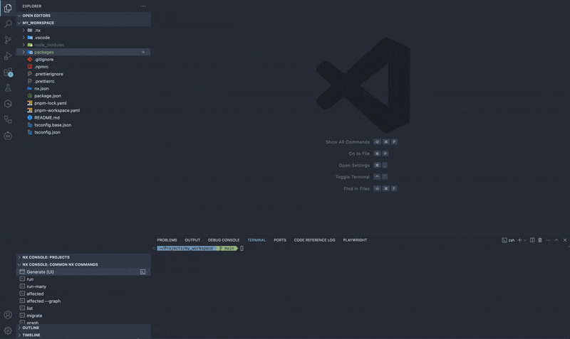

<div align="center">
  <h1>NX plugin for AWS - @aws/nx-plugin</h1>
  <h3>Quickly bootstrap and build AWS projects easily</h3>
  <a href="https://opensource.org/licenses/Apache-2.0">
    
  </a>
  <a href="https://codecov.io/gh/awslabs/nx-plugin-for-aws">
    
  </a>
  <a href="https://gitpod.io/new/?workspaceClass=g1-large#https://github.com/awslabs/nx-plugin-for-aws">
    
  </a>
  <a href="https://github.com/awslabs/nx-plugin-for-aws/actions/workflows/ci.yml">
    
  </a>
  <a href="https://github.com/awslabs/nx-plugin-for-aws/commits/main">
    
  </a>
  <br />
  <br />
  <figure>
    
  </figure>
  👉 See full documentation on <a href="https://awslabs.github.io/nx-plugin-for-aws">https://awslabs.github.io/nx-plugin-for-aws</a> 👈
</div>

## Intro

[@aws/nx-plugin](https://github.com/awslabs/nx-plugin-for-aws) is a collection of generators to help you build cloud-native applications with AWS.

## Key Features

- **Declarative**: Generate code that follows best practices for AWS cloud development.
- **Component-Based**: Add components to your project as needed, from React websites to serverless APIs using either the CLI or UI.
- **Learn Once, Use Anywhere**: Consistent patterns across different AWS services and application types.
- **Open for modification**: All code generated is your code and can be edited as you see fit.
- **Type safety**: Type-safety is employed to support IDE completions and reduce the number of runtime errors encountered.
- **Minimal dependencies**: Getting up and running is simple and only requires langugage level global dependencies.

## Available Generators

- `ts#project` - Generate a new TypeScript library.
- `ts#infra` - Generate a Typescript AWS CDK infrastructure project for your application.
- `ts#react-website` - Generate a new React based web application using Vite.
- `ts#react-website#auth` - Add AWS Cognito authentication to your React website.
- `ts#trpc-api` - Generate a tRPC backend service with Amazon API Gateway/AWS Lambda integrations and [AWS Powertools](https://github.com/aws-powertools/powertools-lambda-typescript) pre-configured.
- `ts#nx-generator` - Add an [Nx Generator](https://nx.dev/features/generate-code) to a TypeScript project.
- `ts#mcp-server` - Add a [Model Context Protocol (MCP)](https://modelcontextprotocol.io/) server to a TypeScript project.
- `ts#lambda-function` - Generate a TypeScript lambda function with optional type-safe event sources.
- `terraform#project` - Generate a new Terraform project.
- `py#project` - Generate a uv based Python project.
- `py#fast-api` - Generate a FastAPI backend service with [AWS Powertools](https://github.com/aws-powertools/powertools-lambda-python) pre-configured.
- `py#lambda-function` - Add a lambda function to an existing python project with optional type-safe event sources.
- `py#mcp-server` - Add a [Model Context Protocol (MCP)](https://modelcontextprotocol.io/) server to a Python project.
- `py#strands-agent` Add a [Strands Agent](https://strandsagents.com/) to a Python project
- `api-connection` - Connect frontend applications to backend APIs.
- `license` - Automatically manage LICENSE files and source code headers in your workspace.

## Getting started

@aws/nx-plugin has been designed for gradual adoption from the start, and **you can use as little or as much of it as you need**.

Follow the [Quick Start](https://awslabs.github.io/nx-plugin-for-aws/en/get_started/quick-start) guide to create a workspace and add projects.

### Additional resources

- [Build a Dungeon Adventure Game](https://awslabs.github.io/nx-plugin-for-aws/en/get_started/tutorials/dungeon-game/overview/) to get an in-depth guided tutorial on how to use the @aws/nx-plugin.
- [Add @aws/nx-plugin to your existing project](https://awslabs.github.io/nx-plugin-for-aws/en/get_started/tutorials/existing-project/)

## MCP Server Installation and Setup

This package additionally provides an MCP server to help AI assistants use the Nx Plugin for AWS.

1. Ensure you have `node` and `npm` installed ([see here](https://docs.npmjs.com/downloading-and-installing-node-js-and-npm))
2. Add the server to your MCP client configuration

Example configuration for Amazon Q CLI MCP (`~/.aws/amazonq/mcp.json`):

```json
{
  "mcpServers": {
    "aws-nx-mcp": {
      "command": "npx",
      "args": ["-y", "-p", "@aws/nx-plugin", "aws-nx-mcp"]
    }
  }
}
```

If you have issues such as `ENOENT npx`, replace the command with `/full/path/to/npx` (use `which npx` to find this).

For more details, [take a look at the guide here](https://awslabs.github.io/nx-plugin-for-aws/en/get_started/building-with-ai/)

## Contributing

The main purpose of this repository is to continue evolving @aws/nx-plugin, making it faster and easier to use. Development happens in the open on GitHub, and we are grateful to the community for contributing bugfixes and improvements.

Read our [Contributing Guide](/CONTRIBUTING.md) to learn about our development process, how to propose bugfixes and improvements, and how to build and test your changes to @aws/nx-plugin.

## Code of Conduct

This project has adopted a Code of Conduct that we expect project participants to adhere to. Please read the [Code of Conduct](/CODE_OF_CONDUCT.md) so that you can understand what actions will and will not be tolerated.

## License

@aws/nx-plugin is [Apache 2.0 licensed](/LICENSE).
