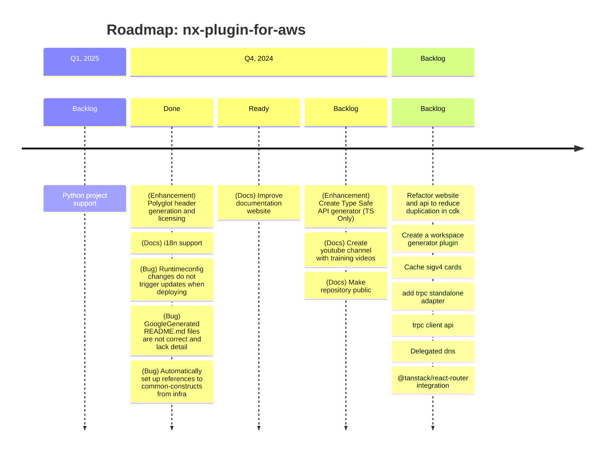

This page shows the roadmap for the nx-plugin, including released features, backlog items, and enhancements ready for _testing_.

```mermaid
timeline
    title Roadmap: nx-plugin-for-aws
    section Q1, 2025
        Backlog : Python project support
    section Q4, 2024
        Done : (Enhancement) Polyglot header generation and licensing: (Docs) i18n support : (Bug) Runtimeconfig changes do not trigger updates when deploying : (Bug) GoogleGenerated README.md files are not correct and lack detail : (Bug) Automatically set up references to common-constructs from infra
        Ready : (Docs) Improve documentation website
        Backlog: (Enhancement) Create Type Safe API generator (TS Only) : (Docs) Create youtube channel with training videos : (Docs) Make repository public
   section Backlog
        Backlog: Refactor website and api to reduce duplication in cdk : Create a workspace generator plugin : Cache sigv4 cards : add trpc standalone adapter : trpc client api : Delegated dns : @tanstack/react-router integration
```